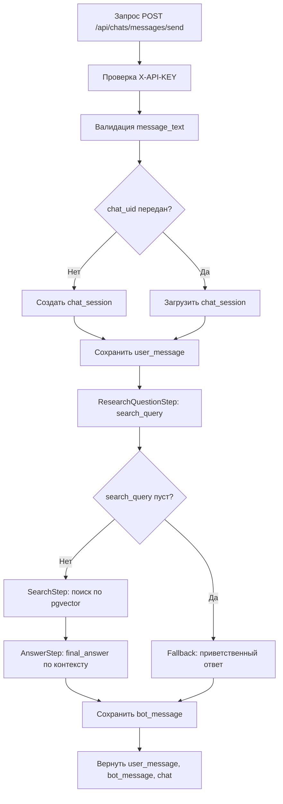

# GPT Final Project

Подробная документация по backend-сервису на `FastAPI` с использованием `PostgreSQL + pgvector` и LLM-пайплайна для ответов по корпоративным документам.

## 1. О проекте

Сервис принимает сообщения пользователя, строит поисковый запрос, ищет релевантные фрагменты в базе знаний и формирует итоговый ответ, сохраняя историю диалога.

Основной сценарий:
- пользователь отправляет вопрос;
- сервис генерирует `search_query` на основе вопроса и контекста диалога;
- выполняется семантический поиск по embeddings;
- LLM формирует финальный ответ строго по найденным фрагментам;
- вопрос и ответ сохраняются в таблицах чата.

## 2. Технологии

- Python 3.12
- FastAPI + Uvicorn
- SQLAlchemy (async) + asyncpg
- PostgreSQL + pgvector
- Alembic (миграции)
- OpenAI SDK (совместимый endpoint)
- Pydantic v2
- Docker, Docker Compose

## 3. Структура репозитория

```text
app/
  api/
    __init__.py
    api_key.py
    chats.py
    dependencies.py
  constants/
    llm_json_schemas.py
  migration/
    env.py
    versions/
      43537e827107_initial_revision.py
      9a2f31d0b4c1_add_chat_session_and_message_tables.py
  models/
    chat_session.py
    document.py
    document_vector.py
    message.py
  repositories/
    chat_session_repository.py
    document_repository.py
    document_vector_repository.py
    message_repository.py
  schemas/
    chat.py
    similarity.py
  services/
    chat_service.py
    embedding_similarity.py
    openai_chat.py
    openai_embedding.py
    send_message_pipeline.py
  config.py
  config_logging.py
  database.py
  main.py

.env.template
alembic.ini
Dockerfile
docker-compose.yml
requirements.txt
```

## 4. Архитектура и поток обработки

### 4.1 Слои
- `api` — HTTP endpoint и DI зависимости.
- `services` — бизнес-логика чата и пайплайн этапов.
- `repositories` — работа с БД.
- `models` — SQLAlchemy-модели.
- `schemas` — Pydantic DTO.
- `migration` — Alembic-ревизии.

### 4.2 Endpoint-поток `POST /api/chats/messages/send`
1. Проверка `X-API-KEY`.
2. Валидация и нормализация входного `message_text`.
3. Создание новой чат-сессии (если `chat_uid = null`) или загрузка существующей.
4. Загрузка последних сообщений истории.
5. Сохранение сообщения пользователя.
6. Выполнение `SendMessagePipeline`:
   - `ResearchQuestionStep`: генерирует один поисковый запрос;
   - `SearchStep`: делает векторный поиск и фильтрацию;
   - `AnswerStep`: формирует финальный ответ на основе контекста.
7. Сохранение сообщения бота.
8. Возврат `user_message`, `bot_message`, `chat`.

### 4.3 Fallback-логика
- При ошибке пайплайна возвращается сообщение об ошибке.
- Если `search_query` пуст (например, приветствие), возвращается приветственный ответ.
- Если ответ не сгенерирован корректно, возвращается безопасный fallback.

### 4.4 Блок-схема `send_message` (основное)



Краткое описание блоков:
- `Проверка X-API-KEY` — защита endpoint от неавторизованных запросов.
- `Валидация message_text` — отбрасывает пустые/некорректные сообщения.
- `Создать/Загрузить chat_session` — определяет контекст диалога.
- `Сохранить user_message` — фиксирует вход пользователя в истории.
- `ResearchQuestionStep` — превращает вопрос пользователя в поисковый запрос.
- `SearchStep` — находит релевантные фрагменты документов по embeddings.
- `AnswerStep` — формирует итоговый ответ только по найденному контексту.
- `Сохранить bot_message` — фиксирует ответ бота и завершает цикл запроса.

## 5. Конфигурация окружения

Проект читает переменные из файла `.env` (по образцу `.env.template`).

```dotenv
DB_HOST=localhost
DB_PORT=5433
DB_NAME=api
DB_USERNAME=api
DB_PASSWORD=api

CHAT_API_KEY=EMPTY
CHAT_BASE_URL=base_url
CHAT_MODEL_NAME=model_name

EMBEDDING_API_KEY=EMPTY
EMBEDDING_BASE_URL=base_url
EMBEDDING_MODEL_NAME=model_name

API_KEY=12345
```

Назначение:
- `API_KEY` — ключ авторизации API (`X-API-KEY`).
- `DB_*` — параметры подключения к БД.
- `CHAT_*` — параметры чат-модели.
- `EMBEDDING_*` — параметры embedding-модели.

Важно:
- в пайплайне должен быть задан хотя бы один API-ключ (`CHAT_API_KEY` или `EMBEDDING_API_KEY`);
- должен быть доступен базовый URL (`CHAT_BASE_URL` или `EMBEDDING_BASE_URL`);
- размерность embedding должна соответствовать БД (`VECTOR(1024)`).

## 6. База данных

Используются схемы `documents` и `chat`.

### 6.1 Таблицы документов
- `documents.documents`: метаданные файла (`file_name`, `file_link`, и т.д.).
- `documents.document_vectors`: текстовые чанки + `embedding VECTOR(1024)`.

### 6.2 Таблицы чата
- `chat.chat_sessions`: карточка диалога (`title`, `is_delete`, `chat_metadata`).
- `chat.messages`: сообщения пользователя/бота, включая `reply_uid`.

### 6.3 Миграции
- `43537e827107` — создание `documents`-схемы и таблиц + `CREATE EXTENSION vector`.
- `9a2f31d0b4c1` — создание `chat`-схемы и таблиц чата.

## 7. API

### 7.1 Общая информация
- Base path: `/api`
- Swagger: `/api/swagger`
- Аутентификация: `X-API-KEY`

### 7.2 Отправка сообщения

`POST /api/chats/messages/send`

Пример запроса:

```json
{
  "chat_uid": null,
  "message_text": "Как открыть ссылку в ДО?",
  "message_metadata": {
    "telegram_message_thread_id": 1001
  }
}
```

Пример `curl`:

```bash
curl -X POST "http://localhost:8000/api/chats/messages/send" \
  -H "Content-Type: application/json" \
  -H "X-API-KEY: 12345" \
  -d "{\"chat_uid\":null,\"message_text\":\"Как открыть ссылку в ДО?\",\"message_metadata\":{\"telegram_message_thread_id\":1001}}"
```

Коды ответа:
- `200` — успешно;
- `400` — пустой `message_text`;
- `401` — неверный API-ключ;
- `404` — передан `chat_uid`, которого нет в БД.

## 8. Запуск проекта

### 8.1 Через Docker Compose (рекомендуется)
1. Создайте `.env` из `.env.template`.
2. Заполните переменные (БД, API-ключи, модель).
3. Запустите:

```bash
docker compose up --build
```

Что делает compose:
- поднимает `postgres` (образ `pgvector/pgvector:pg18-trixie`) на порту `5433`;
- ждет `healthcheck` БД;
- запускает API-контейнер;
- выполняет `alembic upgrade head`;
- стартует `uvicorn` на `8000`.

### 8.2 Локально (без Docker)
1. Установите Python 3.12 и PostgreSQL с `pgvector`.
2. Создайте виртуальное окружение и установите зависимости:

```bash
python -m venv .venv
.venv\Scripts\activate
pip install -r requirements.txt
```

3. Подготовьте `.env`.
4. Примените миграции:

```bash
alembic -c alembic.ini upgrade head
```

5. Запустите API:

```bash
cd app
uvicorn main:app --host 0.0.0.0 --port 8000 --reload
```
